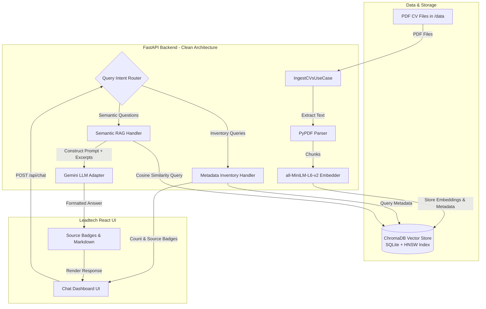

# Leadtech AI CV Assistant — Monorepo

An end-to-end, production-ready AI-powered Candidate CV Scanner and Screening Assistant built for Leadtech recruiters. 

The application uses Retrieval-Augmented Generation (RAG), query intent routing, and local vector embeddings to allow recruiters to query synthetic candidate PDF CVs in real time with 100% accurate inventory counts, semantic skill matching, and verified source document badges.

---

## 1. Project Overview & Features

### Key Capabilities

- **Synthetic Data Generation (Phase 1)**: Automated pipeline (`generator/`) that creates realistic, structured candidate PDF CVs across engineering roles, complete with professional experience, technical skill stacks, and education details.
- **RAG Ingestion Pipeline (Phase 2)**: Extracts text from PDFs using PyPDF, applies overlapping text chunking, and embeds contents locally using `sentence-transformers/all-MiniLM-L6-v2` into ChromaDB.
- **Query Intent Routing**: Intelligent classification in `application/query_intent.py` that separates:
  - **Inventory Queries** (`INVENTORY_COUNT`, `INVENTORY_LIST`): Bypasses vector similarity search and queries metadata registries directly to guarantee exact numbers and 100% complete candidate rosters (e.g., *"How many candidates do we have?"* or *"List all candidates"*).
  - **Semantic Queries** (`SEMANTIC`): Performs cosine vector retrieval on ChromaDB to answer nuanced skill and qualification questions using Gemini LLM generation.
- **Interactive Chat Dashboard (Phase 3)**: Leadtech-branded React + TypeScript + Vite UI featuring sticky floating header layout, markdown response formatting, typing indicators, and real-time candidate source attribution badges.

---

## 2. Monorepo Architecture & Folder Structure

The project strictly adheres to **Clean Architecture** (Hexagonal Architecture / Ports & Adapters) in the backend to ensure high testability, clean dependency inversion, and modularity.

```
ai-cv-scanner/
├── data/                   # Shared directory containing generated candidate PDF CVs
├── generator/              # Synthetic CV generation pipeline (LLM + ReportLab)
├── backend/                # FastAPI RAG backend (Clean Architecture)
│   ├── domain/             # Core domain models (DocumentChunk, SourceDocument) and port protocols
│   ├── application/        # Use-cases (ChatUseCase, IngestCVsUseCase) and Query Intent router
│   ├── infrastructure/     # External adapters (Gemini LLM, PyPDF Parser, ChromaDB Vector Store)
│   ├── api/                # FastAPI routes, Pydantic schemas, and dependency injection wrappers
│   └── tests/              # Comprehensive Python unittest suite (23/23 tests)
├── frontend/               # React + TypeScript + Vite + Tailwind CSS Frontend
│   ├── src/
│   │   ├── components/     # Leadtech Header, ChatWindow, MessageBubble, SourceBadges, etc.
│   │   ├── hooks/          # Custom useChat hook state management
│   │   ├── services/       # API HTTP client
│   │   └── __tests__/      # Vitest + React Testing Library suite (14/14 tests)
│   ├── Dockerfile          # Node 20 Alpine container setup
│   └── vite.config.ts      # Vite & Vitest configuration
├── docker-compose.yml      # Multi-container orchestration (Backend + Frontend)
├── .env.example            # Environment template
└── README.md               # Monorepo documentation
```

---

## 3. Architectural Overview Diagram



---

## 4. Why ChromaDB & How It Works

### How ChromaDB Operates in this App
1. **Extraction & Chunking**: When PDFs are ingested, raw text is extracted per page and sliced into character chunks with overlap (`chunk_size=800`, `chunk_overlap=100`) to preserve sentence context across boundaries.
2. **Local Vector Embedding**: Text chunks are embedded locally using `all-MiniLM-L6-v2` via `sentence-transformers`, converting text into 384-dimensional dense vector representations.
3. **Cosine Indexing**: Vectors are stored in ChromaDB's HNSW graph index configured with cosine similarity distance (`hnsw:space: cosine`).
4. **Metadata Preservation**: Each vector entry is stored alongside metadata attributes (`source_file`, `candidate_name`, `chunk_index`). This enables instant metadata retrieval for inventory counts and exact source attribution badges.

### Why ChromaDB is the Optimal Choice
- **Zero-Config Local Execution**: Embedded persistent storage backed by SQLite — requires no heavy external database server cluster or cloud credentials.
- **Privacy & Speed**: Generates embeddings locally without calling external embedding APIs, ensuring rapid query responses and zero latency overhead.
- **Rich Metadata Filtering & Queries**: Allows querying indexed metadata documents directly, enabling high-precision metadata lookups alongside vector searches.
- **Docker-Native Persistence**: Seamlessly mounts to `./backend/chroma_data`, ensuring vector indices persist reliably across container restarts.

---

## 5. Quickstart: Running with Docker Compose

### Prerequisites
- [Docker](https://www.docker.com/) and Docker Compose installed.

### 1. Environment Setup
Create a root `.env` file from the provided template and add your Gemini API key:

```bash
cp .env.example .env
```

Edit `.env` to include your key:
```env
LLM_PROVIDER=gemini
GEMINI_API_KEY=your_gemini_api_key_here
GEMINI_MODEL=gemini-3.5-flash-lite
```

### 2. Build and Launch Containers
Run Docker Compose from the root directory:

```bash
docker compose up -d --build
```

### 3. Access the Application
- **Frontend Dashboard**: [http://localhost:5173](http://localhost:5173)
- **Backend API & Swagger Docs**: [http://localhost:8000/docs](http://localhost:8000/docs)
- **Health Check Endpoint**: [http://localhost:8000/health](http://localhost:8000/health)

---

## 6. Running Unit & Integration Tests

### Backend Tests (Python `unittest`)
Run the backend test suite locally:

```bash
cd backend
./.venv/bin/python -m unittest discover -s tests
```
*Executes 23 tests covering domain models, intent detection, PDF parsing, FastAPI endpoints, and re-ingestion deduplication.*

### Frontend Tests (Vitest & React Testing Library)
Run the frontend test suite locally:

```bash
cd frontend
npm test
```
*Executes 14 tests covering API clients, `useChat` hook, Leadtech UI components, markdown rendering, and App integration.*

---

## 7. License

This repository is licensed under the [MIT License](LICENSE).
